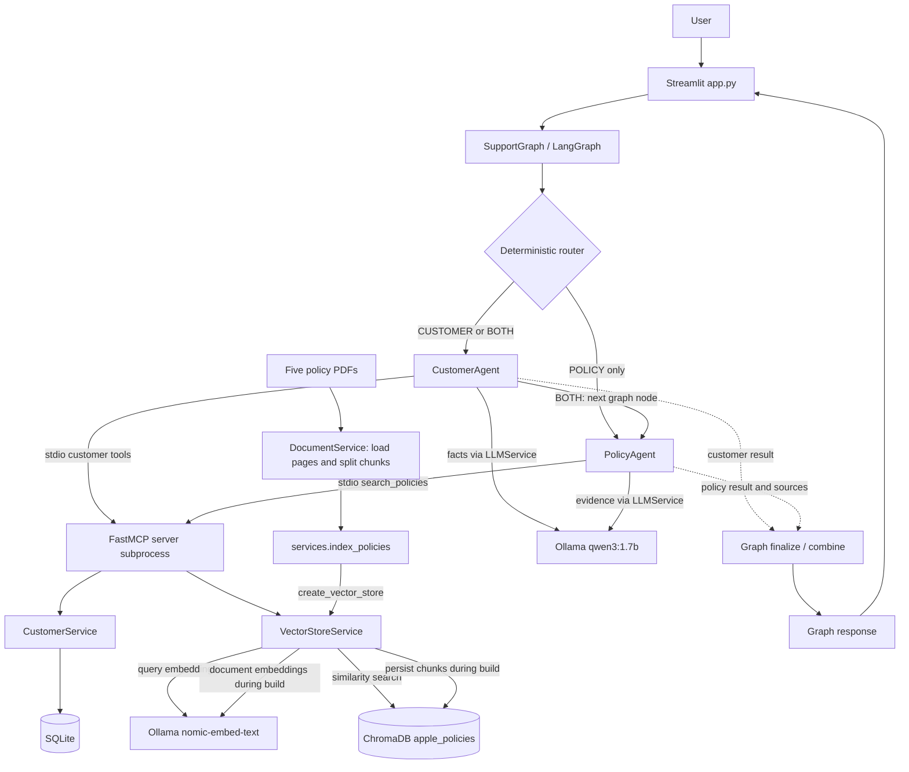

# Multi-Agent AI Customer Support System

A local Generative AI customer-support application combining structured customer/support-ticket data and unstructured Apple policy PDFs. Specialized agents retrieve evidence through Model Context Protocol (MCP), LangGraph orchestrates requests, local Ollama models generate answers, and Streamlit provides the interface. No API keys or paid inference APIs are required. Initial dependency and model downloads require internet access.

## Features

- Natural-language customer lookup by email or supported name forms, including missing-customer and multiple-match handling.
- Historical support-ticket retrieval with product names and available ticket details.
- Policy semantic search and retrieval-augmented generation (RAG).
- Specialized agents with `CUSTOMER`, `POLICY`, and sequential `BOTH` routing.
- Real MCP stdio tool communication and evidence-constrained generation prompts.
- Programmatic policy source metadata and a Streamlit UI showing routes, records, answers, and sources.

## Technology Stack

| Layer | Technology |
|---|---|
| Language | Python; validated with 3.11.6 |
| UI | Streamlit |
| Orchestration | LangGraph StateGraph |
| LLM framework | LangChain |
| Answer generation | Ollama / qwen3:1.7b |
| Embeddings | Ollama / nomic-embed-text |
| Tool protocol | Official Python MCP SDK / FastMCP, stdio |
| Structured data | SQLite via Python sqlite3 |
| Vector database | ChromaDB / langchain-chroma |
| PDF loading | PyPDFLoader / pypdf |
| Chunking | RecursiveCharacterTextSplitter |
| Validation | Integration entry points / jsonschema |

The development environment contains the versions below. Requirements retain the existing largely unpinned policy, with MCP constrained to `>=1.30,<2`. This is a tested baseline, not a complete dependency lock; future releases may require revalidation.

| Package | Tested version |
|---|---|
| langchain-core | 1.6.6 |
| langchain-community | 0.4.2 |
| langchain-text-splitters | 1.1.2 |
| langchain-ollama | 1.1.0 |
| langchain-chroma | 1.1.0 |
| chromadb | 1.5.9 |
| mcp | 1.30.0 |
| langgraph | 1.2.12 |
| streamlit | 1.64.0 |
| pypdf | 6.19.0 |
| jsonschema | 4.26.0 |

## Architecture

Solid arrows show control flow and calls; dotted arrows show agent results. The PDF branch is explicit initialization, separate from runtime retrieval.



### Streamlit UI

`app.py` is presentation-only. Its sole backend entry point is `SupportGraph().ask(question)`, invoked through an async wrapper. It does not directly call agents, MCP, services, databases, or Ollama. Session state retains the latest result, stale answers are cleared before new requests, and failures are displayed. Policy pages are displayed as `page_index + 1`.

### LangGraph / SupportGraph

`graph/support_graph.py` compiles a real LangGraph with router, customer, policy, finalize, and combine nodes. Routing is deterministic rather than depending on the lightweight model to emit an exact classification token. During development, a classification request returned free-form wording (`return policy`) instead of `POLICY`; explicit rules avoid this formatting dependency.

`CUSTOMER` runs CustomerAgent only; `POLICY` runs PolicyAgent only. `BOTH` runs CustomerAgent **then** PolicyAgent sequentially. The graph concatenates their answers without another model call, preserves structured records and sources, and appends an eligibility limitation for return/refund/eligibility questions. Available evidence does not establish eligibility: product applicability, seller, return timing, receipt, and condition must be verified.

### CustomerAgent

The agent extracts a single email or supported name form, opens an MCP stdio session, and calls customer tools. It validates payloads and ticket ownership before generating an answer from returned facts. Tickets are fetched when the question requests tickets or supported support-history signals. Missing and ambiguous matches return a missing-customer response or clarification without LLM generation. The agent never opens SQLite.

### PolicyAgent

The agent calls `search_policies` over MCP with `k=3`, validates evidence and source metadata, and generates an answer constrained to retrieved text. Empty evidence produces an insufficient-information response without generation. Sources are deduplicated programmatically by filename/page. The agent never opens ChromaDB.

### MCP Server

FastMCP exposes four tools and lazily creates the corresponding services. Each agent launches the server using the active Python interpreter and project root working directory. The session/subprocess closes before that agent generates its answer. Tools are the data-access boundary.

### CustomerService / SQLite

CustomerService reads profiles and tickets using parameterized SQL. Name search uses case-insensitive partial matching with literal handling of LIKE wildcards. Ticket queries join products and order by ticket ID. Missing persistence raises an error rather than silently creating a blank database.

### Policy RAG / ChromaDB

DocumentService loads PDF pages and attaches source filenames. The splitter uses 1,000-character chunks with 200-character overlap. VectorStoreService embeds documents during indexing and questions during retrieval, stores collection `apple_policies` in `data/chroma_db/`, and searches existing persistence without rebuilding it.

### Ollama

LLMService uses LangChain ChatOllama with `qwen3:1.7b`, temperature 0, and reasoning disabled. EmbeddingService uses OllamaEmbeddings with `nomic-embed-text`. Both use the local Ollama service; no OpenAI API key is needed.

## Repository Structure

```text
TCSAssignment/
├── agents/
│   ├── __init__.py
│   ├── customer_agent.py
│   └── policy_agent.py
├── data/
│   ├── policies/
│   │   ├── accessibility_standards_policy.pdf
│   │   ├── Apple - Legal - Sales Policies - Canadian Retail Sales.pdf
│   │   ├── Apple-Human-Rights-Policy.pdf
│   │   ├── Business-Conduct-Policy.pdf
│   │   └── law-enforcement-guidelines-us.pdf
│   └── raw/
│       └── customer_support_tickets.csv
├── database/
│   ├── __init__.py
│   ├── database.py
│   └── seed.py
├── graph/
│   ├── __init__.py
│   └── support_graph.py
├── mcp_server/
│   ├── __init__.py
│   ├── server.py
│   └── validate.py
├── models/
│   ├── __init__.py
│   ├── customer.py
│   └── support_ticket.py
├── services/
│   ├── __init__.py
│   ├── customer_service.py
│   ├── document_service.py
│   ├── embedding_service.py
│   ├── index_policies.py
│   ├── llm_service.py
│   └── vector_store_service.py
├── .gitignore
├── app.py
├── requirements.txt
└── README.md
```

Generated local persistence is omitted from this tree and ignored by Git: `database/customer_support.db` and `data/chroma_db/`. Virtual environments, Python caches, editor settings, and local environment files are also ignored. The CSV and five PDFs are required source inputs and must remain in the repository.

## Prerequisites

- Git for cloning.
- Python **3.11 recommended**, matching the checked Windows environment (3.11.6). Other Python versions have not been tested in this pass.
- [Ollama](https://ollama.com/) installed and running locally.
- Internet access for initial package/model downloads and sufficient disk/memory for packages, models, and persistence.

The local model listing reports approximately 1.4 GB for qwen3:1.7b and 274 MB for nomic-embed-text; runtime memory and downloads can differ. Development used Windows PowerShell, 8 GB RAM, and Intel UHD integrated graphics. Response speed varies with hardware. macOS/Linux commands are provided but those platforms have not been validated in this pass.

## Clean-Clone Setup — Windows PowerShell

Run project commands from the repository root. Replace the clone placeholder with your actual URL.

### 1. Clone

```powershell
git clone <YOUR_REPOSITORY_URL> TCSAssignment
cd TCSAssignment
```

### 2. Create and activate a virtual environment

```powershell
python -m venv .venv
.\.venv\Scripts\Activate.ps1
python --version
```

If activation is blocked, use direct interpreter invocation as explained in Troubleshooting.

### 3. Install dependencies

```powershell
python -m pip install --upgrade pip
python -m pip install -r requirements.txt
python -m pip check
```

Requirements include direct third-party runtime imports and jsonschema for MCP validation. Standard-library modules such as sqlite3, csv, asyncio, and unittest require no installation.

### 4. Install/start Ollama and pull models

Install Ollama from the official site above, start its local application/service, and run:

```powershell
ollama pull qwen3:1.7b
ollama pull nomic-embed-text
ollama list
```

The list should contain both models; the embedding model may appear as `nomic-embed-text:latest`. Model downloads are initial setup, not required on every launch.

### 5. Initialize data and launch

Run both First-Time Data Setup commands below, then the application startup command. No `.env` file or API keys are required. Model names and storage paths are configured in the service code.

### macOS / Linux

After cloning and entering the project:

```bash
python3 -m venv .venv
source .venv/bin/activate
python -m pip install --upgrade pip
python -m pip install -r requirements.txt
python -m pip check
```

Install/start Ollama for your platform, pull the same models, and use the same Python initialization/validation and Streamlit commands below.

## First-Time Data Setup

Streamlit and MCP do **not** initialize either database automatically.

### Seed SQLite

```powershell
python -m database.seed
```

This creates the schema and imports `data/raw/customer_support_tickets.csv` into `database/customer_support.db`. The seed script uses root-relative paths; run it from the project root. Expected output:

```text
Database seeded successfully.
Customers imported: 8320
Products imported: 42
Support tickets imported: 8469
```

The importer uses INSERT OR IGNORE for existing customer emails, product names, and ticket IDs. It does not update existing records or synchronize changed CSV rows. Skip seeding on a working installation. To reproduce a changed dataset exactly, back up persistence and build a fresh database separately.

### Build the policy vector index

With Ollama running and nomic-embed-text installed:

```powershell
python -m services.index_policies
```

This small entry point calls the existing DocumentService and VectorStoreService. It loads the five PDFs, splits pages, embeds chunks, and persists `apple_policies` in `data/chroma_db/`. The supplied PDFs produce **202 chunks** with the tested dependencies.

The command refuses an existing persistence directory by default. If PDFs change or a partial build must be retried, explicitly replace the policy collection:

```powershell
python -m services.index_policies --rebuild
```

`--rebuild` resets only `apple_policies` and re-embeds all chunks, avoiding duplicate accumulation. Replacement is not atomic: a failure after reset may require retrying. Missing PDFs/empty chunks are rejected before reset. It does not modify SQLite or source files. Normal app startup never rebuilds the index.

Initialization is generally one-time, repeated only when persistence is absent or source data needs deliberate reinitialization. Do not delete working stores merely to test setup.

## Running the Application

Keep Ollama running and launch from the root with the environment active:

```powershell
streamlit run app.py
```

Streamlit normally opens [http://localhost:8501](http://localhost:8501). Enter a question and click **Ask**. The UI shows the route, answer, available customer/ticket fields, and policy sources. Stop with Ctrl+C. This is the local browser endpoint, not a claim of external accessibility.

There is no separate MCP process to start manually for UI use; agents launch and close their own stdio subprocesses.

## Example Questions

| Type | Example | Expected route |
|---|---|---|
| Customer | Show me the support tickets for Marisa Obrien. | CUSTOMER |
| Policy | What is Apple's return policy? | POLICY |
| Combined | Marisa Obrien wants to return the product from her support ticket. What does Apple's policy say? | BOTH |
| Combined by email | Can carrollallison@example.com return the product from their support ticket under Apple's return policy? | BOTH |

Expected customer evidence: Marisa Obrien, ID 1, `carrollallison@example.com`, ticket 1 for **GoPro Hero**. The synthetic dataset spans product brands; an Apple policy does not establish applicability to a GoPro purchase. Combined responses preserve this eligibility limitation.

### Customer request flow

The customer example follows Streamlit → SupportGraph → CUSTOMER → CustomerAgent → MCP name/ticket tools → CustomerService → SQLite. The agent generates an answer from returned records; the graph returns prose and structured records to the UI.

### Policy request flow

The policy example follows Streamlit → SupportGraph → POLICY → PolicyAgent → MCP search_policies → VectorStoreService → query embedding → Chroma similarity search. PolicyAgent generates an evidence-constrained answer and attaches source metadata; the graph returns both to the UI.

### Combined request flow

The Marisa return example follows BOTH → CustomerAgent lookup and generation → PolicyAgent retrieval and generation → graph combination. Answers are preserved, sources retained, and an eligibility limitation appended. There is no agent fan-out or extra synthesis LLM call.

## Model Context Protocol (MCP)

MCP separates agents from storage/retrieval services. The official SDK supplies the stdio client and FastMCP server. Agents perform a real handshake and tool calls through stdin/stdout. Direct service access is confined to the server and setup/validation utilities; CustomerAgent never accesses SQLite and PolicyAgent never accesses ChromaDB.

| Tool | Input | Output |
|---|---|---|
| get_customer_by_email | email: str | found and customer dictionary or null |
| search_customers_by_name | name: str | count and customer dictionaries |
| get_customer_tickets | customer_id: int | count and ticket dictionaries with product names |
| search_policies | query: str, k: int = 3 | Query and chunks with text, source_file, page_index |

Tools reject empty inputs and nonpositive IDs/counts. Tool selection is deterministic agent code; the LLM generates prose after retrieval.

For protocol inspection only:

```powershell
python -m mcp_server.server
```

The server waits for an MCP client's JSON-RPC input, not chat text. It does not expose an HTTP endpoint. Stdout is reserved for protocol responses and diagnostics belong on stderr. Use the validation client below for a full tool exercise.

## Retrieval-Augmented Generation

Indexing: PDFs → PyPDFLoader → pages → RecursiveCharacterTextSplitter → chunks → nomic-embed-text → ChromaDB.

Querying: question → query embedding → similarity search → top 3 policy chunks → grounded prompt → qwen3:1.7b → answer.

Chunks preserve `source_file` and zero-based `page` metadata. MCP exposes `page_index`; PolicyAgent validates/deduplicates sources, and Streamlit displays one-based pages. The system does not rely on the LLM inventing citations. A source identifies retrieved evidence, not independent verification of every generated sentence.

Search has no reranker or relevance cutoff. Unusual questions can retrieve loosely related text. The prompt requests an insufficient-information response when evidence cannot answer the question, but source presence does not guarantee relevance or eliminate hallucination.

## Structured Data

| Table | Contents | Relationships |
|---|---|---|
| customers | Name, unique required email, age, gender | Auto-increment customer ID |
| products | Unique required product name | Auto-increment product ID |
| support_tickets | Purchase date, type, subject, description, status, resolution, priority, channel, timing, satisfaction | Ticket ID primary key; required customer foreign key; optional product foreign key |

Customers can have multiple tickets and products can be referenced by multiple tickets. Connections enable SQLite foreign-key enforcement. Missing CSV resolution/timing/rating values become SQL NULL. Dataclasses expose customer fields and joined ticket/product data.

## Multi-Agent Routing

| Route | Signals at a high level | Execution |
|---|---|---|
| CUSTOMER | Customer/profile/ticket intent, email, or supported name form without policy intent | CustomerAgent → finalize |
| POLICY | Policy/return/refund/accessibility/human-rights and related intent without a specific customer signal | PolicyAgent → finalize |
| BOTH | Policy intent together with email, ticket/profile/purchase signals, or supported leading-name intent | CustomerAgent → PolicyAgent → combine |

Unrecognized nonempty questions default to POLICY; blank inputs are rejected. Generic “customers” in an accommodation question is not a specific identifier. Rules have finite coverage and unsupported phrasing can misroute or require clarification.

Combined questions separate supported customer identifiers from policy intent. Return/refund questions use a normalized Apple policy retrieval query. These are intentionally limited deterministic transformations, not general entity extraction or eligibility adjudication.

## Local Models

| Model | Role |
|---|---|
| qwen3:1.7b | Answer generation from retrieved facts/evidence |
| nomic-embed-text | Semantic embeddings for documents and queries |

Both run locally through Ollama. No OpenAI API key or paid inference API is needed. Initial model loading can slow the first response; performance varies with CPU/GPU, free RAM, and model residency.

## Validation / Testing

Run from the root with the environment active, initialized databases, and Ollama running. These checks perform real tool/model calls and can take several minutes on modest hardware. Keep them sequential.

```powershell
python -m pip check
python -m mcp_server.validate
python -m agents.customer_agent
python -m agents.policy_agent
python -m graph.support_graph
```

| Command | Coverage |
|---|---|
| python -m pip check | Installed dependency consistency |
| python -m mcp_server.validate | Direct tools, serialization, invalid inputs, missing customer, real stdio handshake, schemas/calls, SQLite counts/hash, Chroma count/IDs |
| python -m agents.customer_agent | Real MCP email/name/ticket calls, known records, generation counts, missing-customer generation skip |
| python -m agents.policy_agent | Live policy examples and sources, including an unsupported topic; a smoke demonstration rather than a comprehensive assertion suite |
| python -m graph.support_graph | Router cases, blank-input rejection, four live examples, agent isolation/order, sources, and eligibility limitation |

| Data check | Expected |
|---|---|
| Customers | 8,320 |
| Products | 42 |
| Support tickets | 8,469 |
| Chroma apple_policies | 202 chunks |
| Known customer | Marisa Obrien; ID 1; carrollallison@example.com |
| Known ticket | ID 1; GoPro Hero |

MCP validation checks SQLite SHA-256 before/after reads and Chroma IDs/counts. Opening Chroma may rewrite internal bookkeeping; unchanged IDs/counts do not establish byte-for-byte unchanged vector persistence.

The cleanup pass checks regeneration in a temporary source copy without existing persistence, using installed dependencies and local models. This does not substitute for testing a completely fresh dependency installation on a separate machine.

## Troubleshooting

| Problem | Resolution |
|---|---|
| ollama command not found | Install Ollama and reopen the terminal for PATH changes. |
| Model missing | Run both model pull commands above and inspect ollama list. |
| Cannot connect to Ollama | Start the local application/service. A terminal installation can use `ollama serve`; avoid a second instance if already running. |
| ModuleNotFoundError | Activate the intended environment, run `python -m pip install -r requirements.txt`, and use the root working directory. |
| SQLite missing / tables absent | Run `python -m database.seed` from the root. An empty database is not initialized persistence. |
| Chroma missing / collection absent | Run `python -m services.index_policies`; an existing partial build requires deliberate `--rebuild`. |
| Index reports existing persistence | Skip indexing on working installs. Use --rebuild only when replacing the policy collection is intended. |
| Unexpected counts | Check supplied source files and dependency versions. Seed does not update existing records; compare a separate fresh build. |
| PDF font/object warnings during indexing | The supplied PDFs produced 55 pages and 202 chunks despite pypdf font/offset warnings in the tested environment. If extraction fails or text is garbled, inspect parser warnings and the affected PDF before accepting the index. |
| Slow first response / indexing | Allow models to load, free memory, and run checks sequentially. |
| Irrelevant policy evidence | Inspect source pages. Retrieval has no relevance threshold; a semantic match is not an eligibility decision. |
| MCP timeout | Check Ollama and machine load. Agent MCP sessions have a 90-second read timeout that embedding delays can exceed. |

### Streamlit port already in use

```powershell
streamlit run app.py --server.port 8502
```

Use `http://localhost:8502`.

### PowerShell activation blocked

Activation is optional. Use the venv interpreter directly without changing global execution policy:

```powershell
.\.venv\Scripts\python.exe -m pip install -r requirements.txt
.\.venv\Scripts\python.exe -m database.seed
.\.venv\Scripts\python.exe -m services.index_policies
.\.venv\Scripts\python.exe -m mcp_server.validate
.\.venv\Scripts\python.exe -m streamlit run app.py
```

Seed/index commands apply to fresh installations; skip them when persistence is already working.

## Design Decisions

| Choice | Reason |
|---|---|
| SQLite | Local relational joins/constraints without server setup |
| ChromaDB | Persistent local semantic policy retrieval |
| MCP | Explicit boundary between agents and data services |
| Specialized agents | Separate structured-data and policy-evidence workflows/prompts |
| LangGraph | Explicit state and conditional node transitions |
| Deterministic routing | Avoid dependence on exact free-form model classification tokens |
| Local Ollama | Inference without paid cloud credentials |
| Sequential BOTH | Limit concurrent work on 8 GB RAM / integrated graphics |
| Programmatic sources | Preserve retrieval metadata independently of generated prose |

## Limitations

- Routing/name extraction support finite signals and forms.
- Lightweight model output can be less polished or inaccurate; grounding prompts do not guarantee correctness.
- Policy knowledge is limited to five indexed PDFs with different purposes/jurisdictions; documents are not updated automatically.
- Synthetic customer data spans multiple brands; Apple policy need not apply to a ticket product.
- Retrieval has no relevance cutoff/reranking and can return insufficient evidence.
- The UI is a local demo with last-result session state, not an authenticated production support application or conversational-memory agent.
- Hardware affects response speed; largely unpinned dependencies can change future installation behavior.

## Future Improvements

Potential follow-ups: structured routing with a stronger model, retrieval reranking/thresholds, conversation memory, authentication/authorization, evaluation suites, tracing, containerization, and automated tests/CI. These are not implemented in this cleanup pass.

## Next Steps

As next steps, I'd focus mainly on production readiness and performance.

I'd add a relevance threshold or reranker to improve policy retrieval, conversation memory for multi-turn support interactions, and stronger evaluation and observability.

I'd also add authentication and access controls around customer information.

Finally, I'd optimize latency by reducing repeated process initialization and exploring persistent MCP connections and parallel agent execution on stronger hardware.

## Security / Privacy Notes

Models run locally through Ollama and the supplied customer dataset is synthetic. No paid cloud LLM is required. The demo does not claim production security or compliance and has no authentication/access-control layer. Restrict local data/services appropriately before adapting it to real records.

No secrets or API keys are needed. Local environment files and generated persistence are ignored; source CSV/PDFs remain repository inputs.

## Demo

> Demo video: `<https://www.youtube.com/watch?v=KVvwFkqOUE0>`

Replace this placeholder when the assignment demo URL is available.
